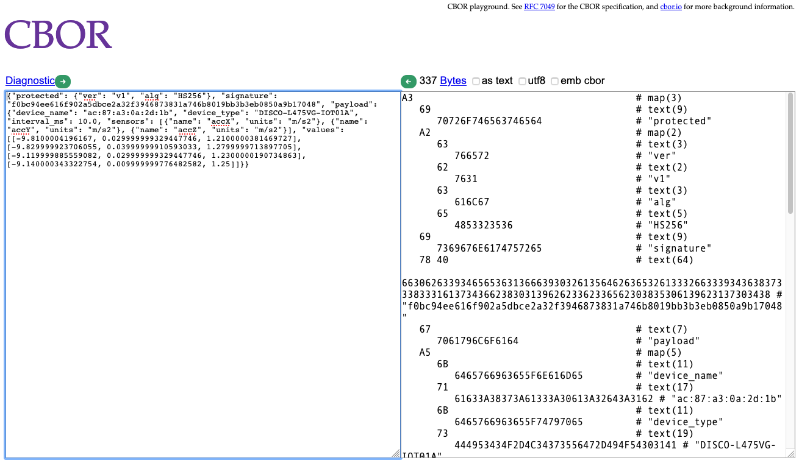

# Edge Impulse C Ingestion SDK

The C Ingestion SDK is a portable header-only library written in C99 for data collection on embedded devices. It's designed to reliably store sampled data from sensors at a high frequency in very little memory. On top of this it allows cryptographic signing of the data when sampling is complete. Data can be stored on a POSIX file system, in memory, or on a raw block device.

[Usage guide](https://docs.edgeimpulse.com/reference#c-sdk-usage-guide)

## Importing this repository

This library depends on QCBOR and (optionally) Mbed TLS. These are pulled in through git submodules. To import this repository:

1. Clone this repository:

    ```
    $ git clone https://github.com/edgeimpulse/ingestion-sdk-c
    ```

1. Initialize the submodules:

    ```
    $ cd ingestion-sdk-c
    $ git submodule update --init --recursive
    ```

## Building the example application

To build an example application which can encode data that runs on your computer:

### MacOS, Linux

1. Import the repository and its submodules.
1. Compile the application (see [test/main.c](test/main.c) for the code):

    ```
    $ make
    ```

1. Run the application:

    ```
    $ ./ingestion-sdk-example
    ```

    This prints the encoded message both to stdout, and creates a file called `test/encoded.cbor` with the same content.

### Windows

To build an example application which can encode data that runs on your computer:

1. Import the repository and its submodules.
1. Install [MinGW-W64](https://sourceforge.net/projects/mingw-w64/files/Toolchains%20targetting%20Win32/Personal%20Builds/mingw-builds/installer/mingw-w64-install.exe/download) and install according to [these instructions](https://tls.mbed.org/kb/compiling-and-building/compiling-mbedtls-in-mingw).
    * Make sure that `mingw32-make` and `gcc` are in your PATH.
1. Compile the application (see [test/main.c](test/main.c) for the code):

    ```
    $ mingw32-make CC=gcc
    ```

1. Run the application:

    ```
    $ ingestion-sdk-example.exe
    ```

    This prints the encoded message both to stdout, and creates a file called `test/encoded.cbor` with the same content.

### Viewing the payload

1. After running the binary above, copy the content after 'Encoded file:'.
1. Go [cbor.me](http://cbor.me), paste the content in the 'Bytes' text box (the right one), then click the green arrow next to 'Bytes'. You now see the decoded message:

    

### Validating the signature

To validate the signature in the message:

1. Install a recent version of Node.js.
1. Install the `cbor` npm package:

    ```
    $ cd test
    $ npm install cbor
    ```

1. Decode the message:

    ```
    $ node decode.js
    ```

1. This prints the message, whether the signature was valid, and the payload:

    ```
    Full object {
      protected: { ver: 'v1', alg: 'HS256' },
      signature: 'f0bc94ee616f902a5dbce2a32f3946873831a746b8019bb3b3eb0850a9b17048',
      payload: {
        device_name: 'ac:87:a3:0a:2d:1b',
        device_type: 'DISCO-L475VG-IOT01A',
        interval_ms: 10,
        sensors: [ [Object], [Object], [Object] ],
        values: [ [Array], [Array], [Array], [Array] ]
      }
    }
    Signature verification OK
    Payload {
      device_name: 'ac:87:a3:0a:2d:1b',
      device_type: 'DISCO-L475VG-IOT01A',
      interval_ms: 10,
      sensors: [
        { name: 'accX', units: 'm/s2' },
        { name: 'accY', units: 'm/s2' },
        { name: 'accZ', units: 'm/s2' }
      ],
      values: [
        [ -9.8100004196167, 0.029999999329447746, 1.2100000381469727 ],
        [ -9.829999923706055, 0.03999999910593033, 1.2799999713897705 ],
        [ -9.119999885559082, 0.029999999329447746, 1.2300000190734863 ],
        [ -9.140000343322754, 0.009999999776482582, 1.25 ]
      ]
    }
    ```
